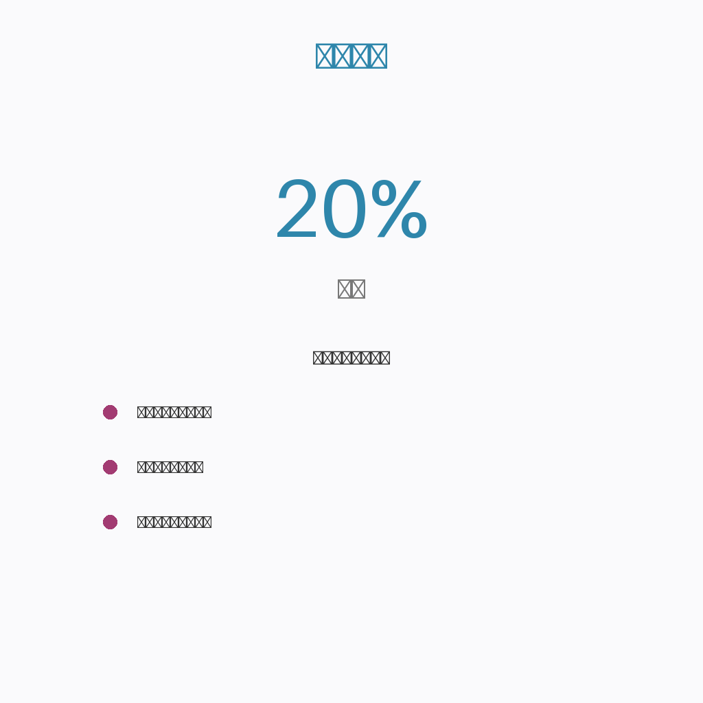

# 途牛终于赚钱了，但酒店人该盯的不是那2970万

*适合阅读人群：酒店业主、运营负责人、渠道经理，以及正在思考如何从"卖房间"转向"卖体验"的住宿业从业者*

---

## 这份财报，藏着两个容易被误读的信号

途牛2024年第四季度净收入同比增长超20%，全年净利润2970万元。数字不算惊艳，但意义不小——这是途牛自2014年上市以来的首个全年盈利。

很多人看到"盈利"两个字，第一反应是：在线旅游终于回暖了，可以加大投放了。但真正重要的是，途牛是怎么盈利的？

仔细看结构：打包旅游产品收入占比超过七成，而传统的酒店机票单项预订，增速明显放缓。说白了，途牛赚的不是"卖房间"的钱，是"卖旅程"的钱。用户要的不是一张床，而是一套解决方案。

这对酒店意味着什么？渠道的逻辑已经变了。单纯把房源挂上去、等订单进来的时代，正在加速退场。

## 为什么"卖旅程"的渠道开始跑赢"卖房间"？

背后的逻辑其实很简单：消费者的决策链路越来越长，也越来越懒。

以前订酒店，打开App，比价格、看评分、下单，三步搞定。现在呢？用户可能先被一段新疆自驾游的视频种草，再搜路线、看攻略、比价机票，才落到住哪儿。整个决策周期从几天拉长到几周，甚至几个月。

途牛这类平台的聪明之处，在于把自己嵌入了这个长链条的前端。他们不是等用户搜索"酒店"，而是在用户还没想清楚去哪儿的时候，就把"住什么"打包进了答案里。

更关键的是，这种模式下，酒店的角色被重新定义了。你不再是"被比价的选项"，而是"旅程体验的一部分"。一家沙漠观星主题酒店，在携程上可能拼不过连锁品牌的会员折扣，但在"腾格里沙漠徒步6日游"的打包产品里，它就是不可替代的卖点。

换个角度想，渠道的分化，本质上是在倒逼酒店想清楚：你的不可替代性，到底在哪里？

## 酒店人该做的三件事，别等渠道来教你

基于这个变化，我给酒店同行三个实操建议，都是能立刻动手、不用等预算的。

**第一，重新梳理你的"内容资产"**

大多数酒店的产品详情页，还停留在"豪华大床房35平米"这种描述。但途牛的销售告诉我，转化率高的合作酒店，详情页里一定有"体验场景"——几点能看到日照金山、哪扇窗对着稻田、管家能带你去找萤火虫。

这些素材不用花钱拍大片，手机实录反而更真实。关键是，你要把这些内容，翻译成渠道能用的"弹药"，而不是扔给他们一张房型表。

**第二，主动设计"套餐友好型"产品**

不是简单地把早餐加进去就叫套餐。真正好卖的产品，要解决用户的一个具体焦虑。比如亲子家庭怕孩子无聊，你的套餐里能不能包含半小时的陶艺体验？商务客人怕早班机赶不上，能不能打包送机服务？

你会发现，当你把服务拆成模块，渠道的销售更愿意推你——因为他们的KPI不是卖出房间，是卖出差异化。

**第三，建立"渠道健康度"的月度复盘**

别再只盯产量和佣金率了。建议每个月问自己三个问题：这个渠道来的客人，平均住几晚？复购率多少？有没有主动搜索过我们品牌？

如果答案都是"不知道"，那你就是在 blind booking（盲订）。我认识一家云南的民宿老板，去年开始用Excel手动追踪不同渠道的客人后续行为，三个月后果断砍掉了一个看似产量不错、实则全是价格敏感客的渠道，RevPAR反而涨了15%。

## 一家县城酒店的"反常识"操作

说个真实的例子。浙江安吉有家只有12间房的精品民宿，2023年差点被高昂的OTA佣金拖垮。老板老陈的转折点，是发现自家客人80%来自上海，而且多是"周末逃离"的需求。

他没去谈更低的佣金，而是主动找到途牛、马蜂窝的定制游部门，把自己包装成"竹海疗愈周末"的核心环节。房价比直订贵了30%，但包含了采茶体验和私人导览。结果？套餐的毛利反而更高，而且客人提前两周就锁定库存，取消率极低。

有意思的是，这些客人后来有一半关注了民宿的公众号，今年清明直接微信订房，零佣金。老陈现在把OTA当成"获客入口"，而不是"销售渠道"，整个财务模型都变了。

## 写在

途牛盈利2970万，这个数字本身对酒店人没那么重要。重要的是，它验证了一个趋势：旅游消费的决策权，正在从"搜索比价"转向"内容种草"和"场景打包"。

还在抱怨佣金高的酒店，可能没意识到，问题不在于渠道收多少，而在于你在渠道眼里值多少。当你能提供不可替代的体验，渠道会抢着合作；当你只是万千房源中的一个，就只能卷价格。

这个春天，不妨抽一个下午，重新审视一下你的渠道策略。不是看花了多少钱，而是看每一分钱，买的是流量，还是关系。

---

## 📊 数据洞察

### 行业结构分析

---

## 🎯 核心观点

---

*本文数据来源：品橙旅游*
*适合人群：酒店投资人、运营负责人*
*发布时间：2026年03月08日*

---

**关于我们**

酒店渠道参谋 —— 帮中小酒店看清渠道成本、优化收益结构的实战顾问。

关注公众号，获取更多酒店运营干货。
