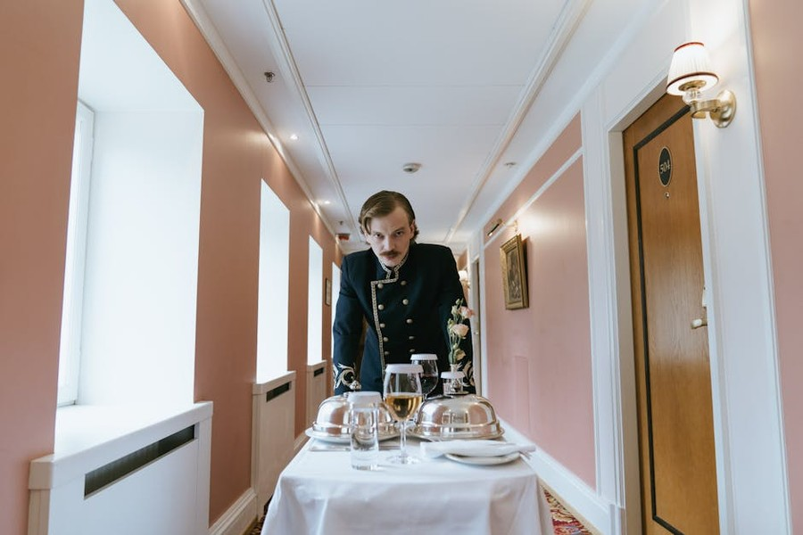
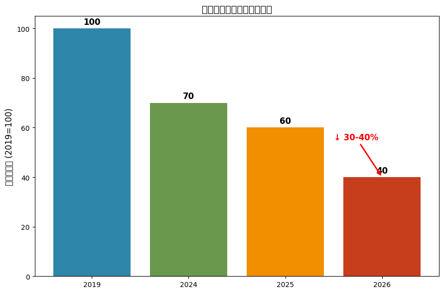
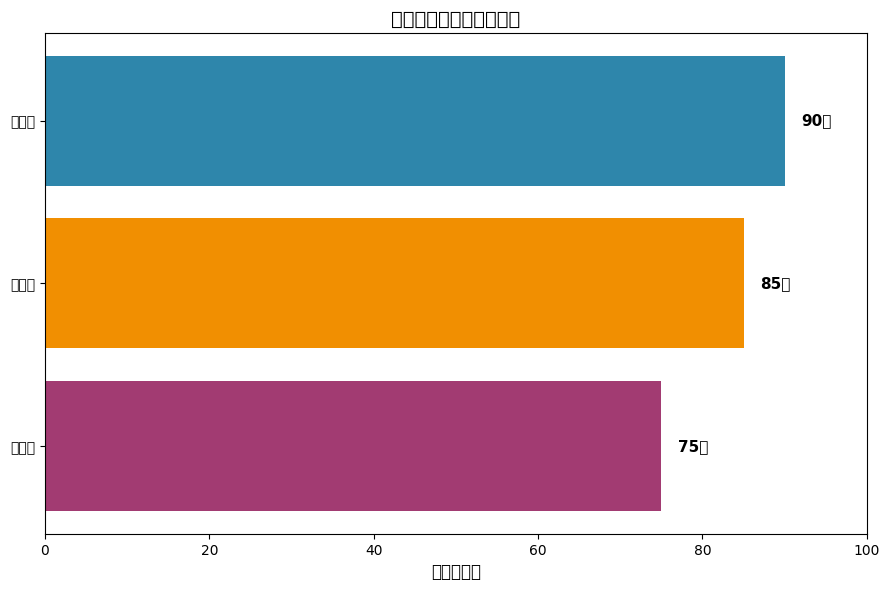
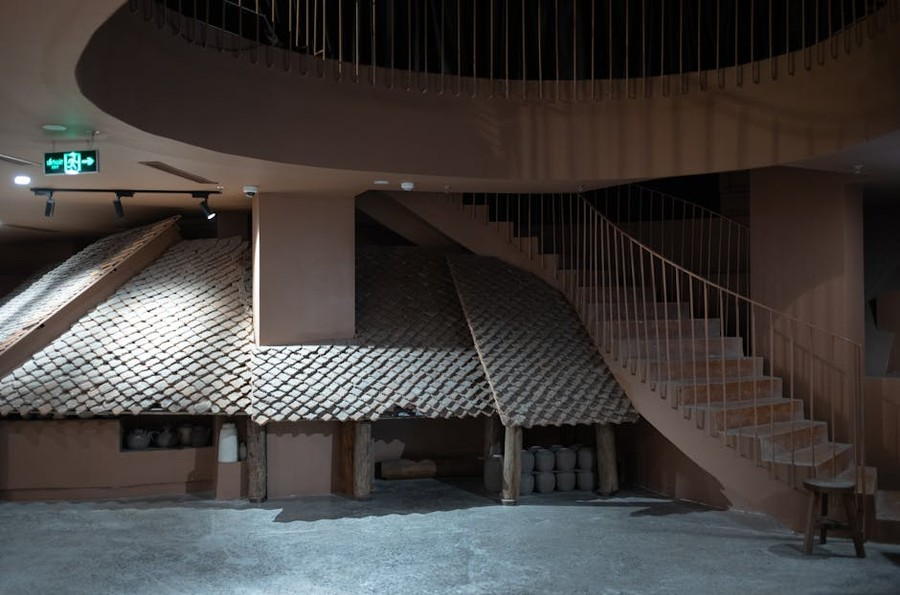
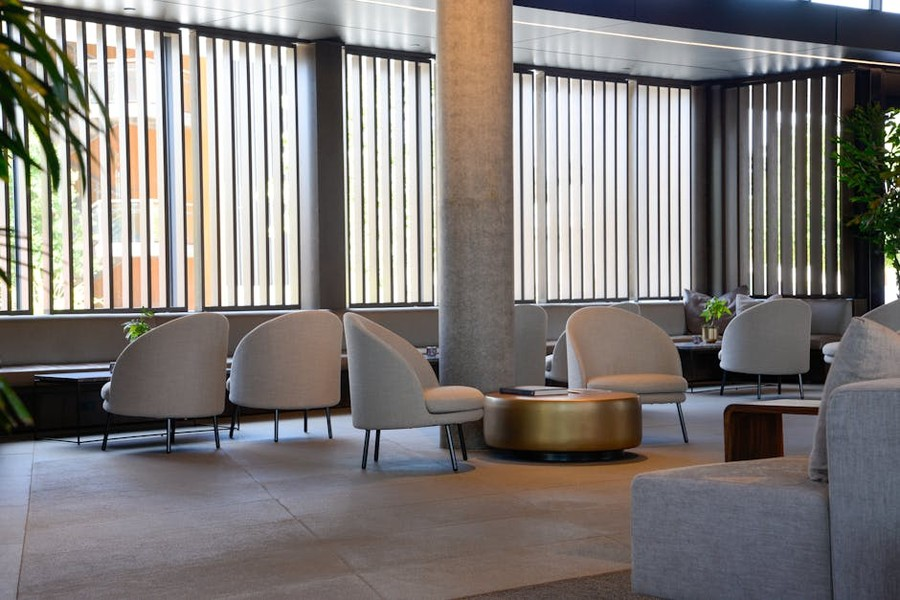
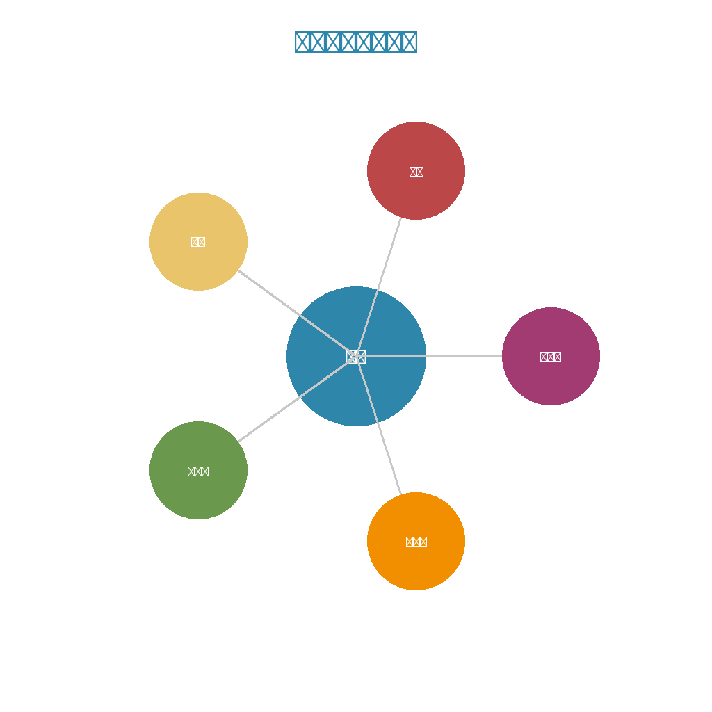

# 一个反常的电话：今年春糖，酒店还能满房吗？

*我是源点Insight，帮你算清每一笔账，助你实现酒店精准增长。*

---

## 一、数据冲击：今年春糖有多冷？

**参展商：至少减少30%-40%**

根据行业内部预测，2026年成都春季糖酒会的参展商数量将同比减少30%至40%，可能成为近十年来最冷清的一届。

**头部效应：**
- 五粮液于2025年底正式宣布取消酒店展，仅保留会展中心主展
- 茅台、泸州老窖等品牌虽未官宣，但也大幅缩减了酒店展投入

**市场情绪：**
中小品牌普遍处于观望状态，参展意愿降至冰点。

**酒店端：集体迷茫的价格策略**

面对需求的不确定性，成都酒店业呈现出罕见的"价格分化"。

## 二、深层分析：为什么传统模式失效了？

作为携程商旅的一线观察者，我看到的真相是：不是需求消失了，而是需求的结构彻底变了。

## 1. 大展位逻辑崩塌

过去十年，糖酒会的核心是"面子工程"，靠卖展位空间赚差价。但现在，品牌砍预算、经销商变精明，华而不实的展位不再是成交的保障。

## 2. 从"广撒网"到"精准撮合"

五粮液撤出酒店展，是因为他们需要的是"核心客户深度服务"，而非"泛流量曝光"。这意味着酒店不能再幻想"满房"，而应把空间转化为"精准商务场景"。

## 3. 中小品牌的生存策略转变

大量中小品牌、新消费品牌不再追求大场地，他们需要的是小型、私密的品鉴场景与高效的1对1洽谈空间。

## 三、实操方法论：三类赢家的应对策略

基于一线调研，我总结出今年春糖三种可能赚钱的玩法：

## 第一类：捡漏型——承接被毁约的资源

**逻辑：** 广告公司毁约后，酒店有大量闲置的优质空间（大堂、会议室、餐厅等）。

**关键动作：** 重点盯核心布展酒店（如香格里拉、锦江宾馆），以"时段+服务"打包方案，低成本拿下空间并转租给中小品牌。

## 第二类：精准型——专注高净值小圈层

**逻辑：** 高端奢华酒店依然有生意，因为高质量商务需求从"逛展"转向了"深度社交"。

**关键动作：** 放弃散客，主动接洽小众品牌，推出"品牌专场"包场服务，通过私域预售确保基础人流。

## 第三类：转型型——从"空间方"到"运营商"

**逻辑：** 核心竞争力从"卖房间"转向"卖商务解决方案"。

**关键动作：** 定制产品（如"投资人快闪""供应链深访"），整合MCN、行业协会资源，共同分担风险。

## 四、决策框架：你的酒店该选哪条路？

| 酒店类型 | 资源禀赋 | 推荐策略 | 关键动作 |
|:---|:---|:---|:---|
| 高端奢华 | 品牌、私密 | 精准型 | 做圈层专场，提客单价 |
| 精品特色 | 差异化、灵活 | 精准/转型 | 设计主题体验，提前锁客 |
| 中端连锁 | 规模、标准 | 转型型 | 整合资源，做解决方案 |
| 经济/偏远 | 成本低 | 捡漏型 | 承接溢出需求，做配套 |
| 传统五星 | 地理位置 | 必须转型 | 放下身段，主动求变 |

## 总结：冷年生存的核心认知

糖酒会从来没有不行过，不行的只是那些拒绝改变的玩家。

第一步，算清账；
第二步，定策略；
第三步，快行动。

---

## 📊 数据洞察

### 关键数据趋势

### 行业结构分析

---

## 🎯 核心观点

---

*本文数据来源：携程商旅一线观察*
*适合人群：酒店投资人、运营负责人*
*发布时间：2026年03月07日*

---

**关于我们**

酒店渠道参谋 —— 帮中小酒店看清渠道成本、优化收益结构的实战顾问。

关注公众号，获取更多酒店运营干货。
