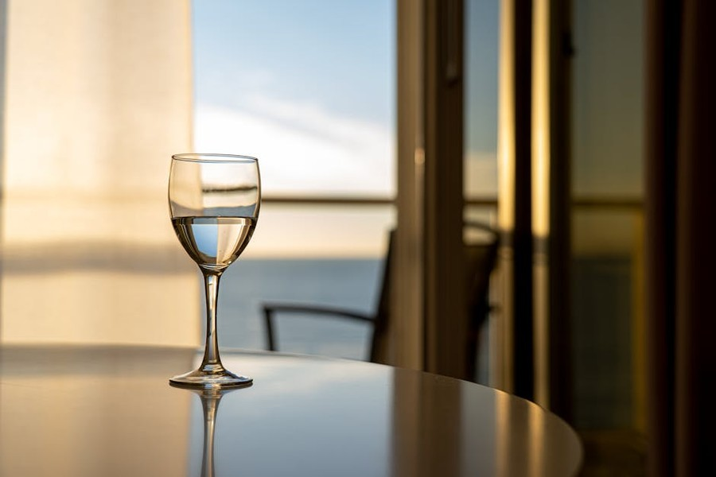
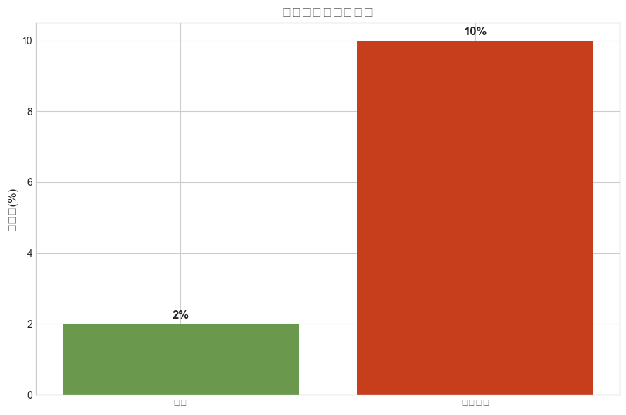
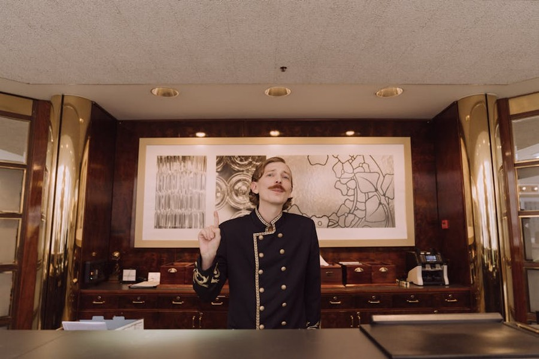
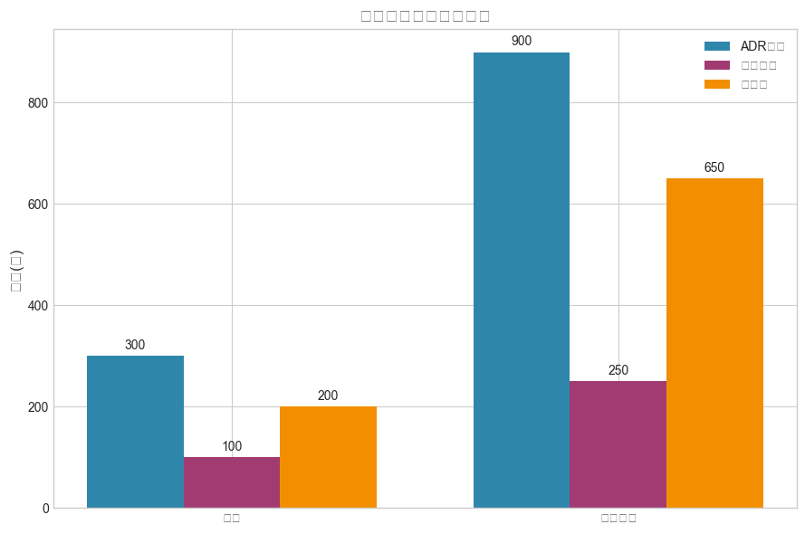
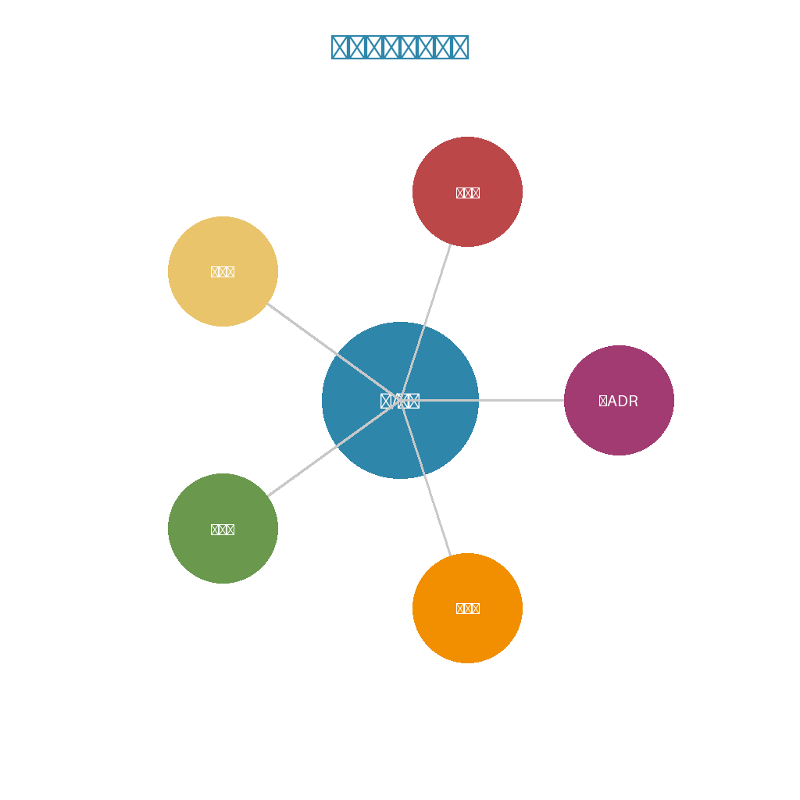

# 糖酒会背后的酒店生意：展会客人到底值不值得接？

---
*数据来源：成都酒店行业协会、OTA平台公开数据*
*适合人群：中小酒店投资人、运营负责人*

---

## 糖酒会的真实面目

先泼盆冷水。

糖酒会、车展、各种展会——本质是**一次性流量**。客人来是为了参展，不是为了住你的酒店。他们对价格不敏感（公司报销），但对服务极度敏感（因为累）。

数据说话：
- 展会期间ADR通常是平时的2-3倍
- 但投诉率是平时的5倍
- 回头客比例不到5%
- OTA差评中"展会期间"占比高达40%

很多酒店老板算不清这笔账：只看收入涨了，没算口碑跌了。

## 算账：展会客人的真实成本

假设你平时ADR 300元，糖酒会期间900元。看起来赚了600元溢价，对吧？

但真实成本：

**直接成本**
- 员工加班费（展会期间工作量翻倍）
- 布草损耗增加（客人使用频率高）
- 投诉处理成本（退款、补偿、平台申诉）

**间接成本**
- OTA评分下降（影响未来30天订单）
- 差评回复时间成本
- 平台流量权重降低

**真实案例**

成都某精品酒店，2024年糖酒会期间：
- 收入：比平时多8万
- 但评分从4.8降到4.2
- 接下来2个月订单下降30%
- 综合算账：亏了

## 什么酒店适合接展会客？

不是所有人都该拒绝展会。关键看**你的定位**。

**适合接的情况：**
- 商务型酒店（设施匹配需求）
- 有专门会展服务团队
- 评分已经稳定在4.7以上（有缓冲空间）
- 主要依赖商务客源（不怕差评影响）

**不适合接的情况：**
- 精品/民宿型（客人预期落差大）
- 评分在4.5以下（经不起折腾）
- 依赖休闲客源（差评影响大）
- 没有足够人手应对高峰

## 如果一定要接，怎么降低风险？

**展前准备**
- 提前1周涨价（筛选价格敏感客人）
- 在OTA详情页标注"展会期间服务调整"
- 准备简易早餐（展会客人早起，等不及）
- 增加临时保洁人手

**展中管控**
- 前台提前告知：电梯等待时间、早餐高峰
- 建立快速投诉响应（2小时内解决）
- 主动邀请满意客人留好评（对冲差评）

**展后修复**
- 48小时内回复所有差评
- 给投诉客人发优惠券（挽回口碑）
- 分析差评原因，优化明年流程

## 更聪明的做法：差异化定价

不是全接，也不是全拒。可以**分层定价**：

- 标准房：涨价50%（留给散客）
- 高级房：涨价200%（留给展会客）
- 套房：涨价300%（留给高价值展会客）

这样既赚了展会红利，又保留了基础口碑。

## 最后说几句

糖酒会是成都酒店每年的"大考"。

有人靠它赚一个月，有人靠它亏半年。差别不在运气，在**有没有算清真实成本**。

你的酒店，今年糖酒会怎么接？

---

## 📊 数据洞察

### 关键数据趋势

### 行业结构分析

---

## 🎯 核心观点

---

*本文数据来源：成都酒店行业协会*
*适合人群：酒店投资人、运营负责人*
*发布时间：2026年03月07日*

---

**关于我们**

酒店渠道参谋 —— 帮中小酒店看清渠道成本、优化收益结构的实战顾问。

关注公众号，获取更多酒店运营干货。
